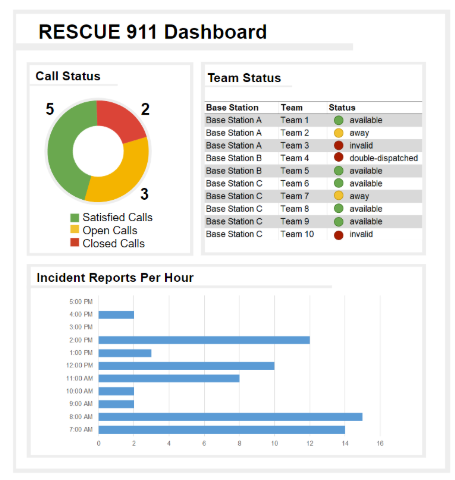
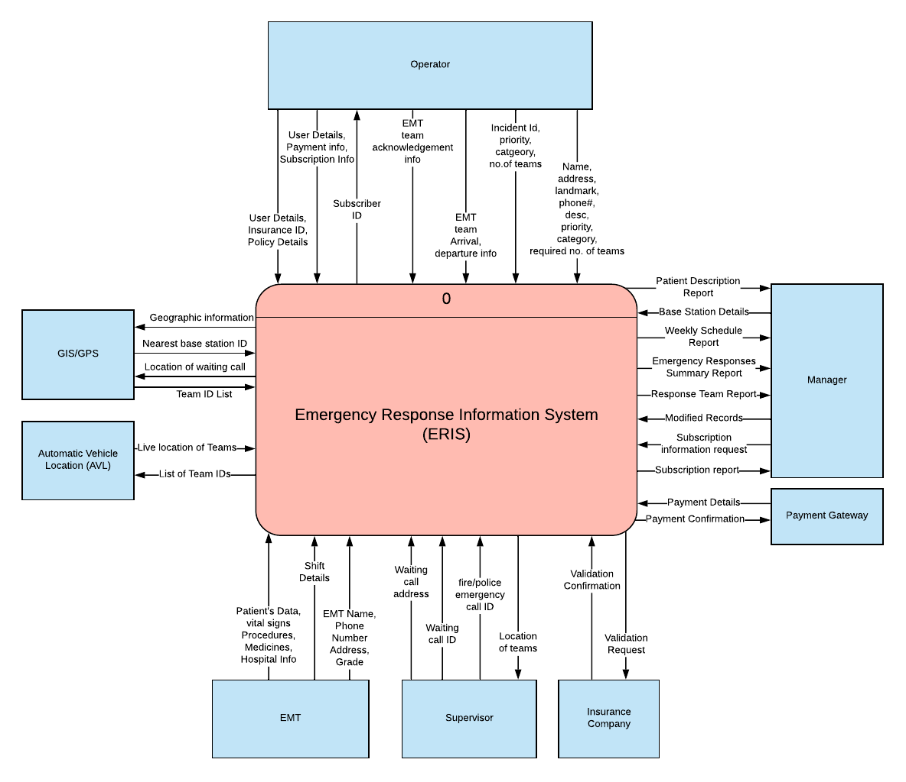
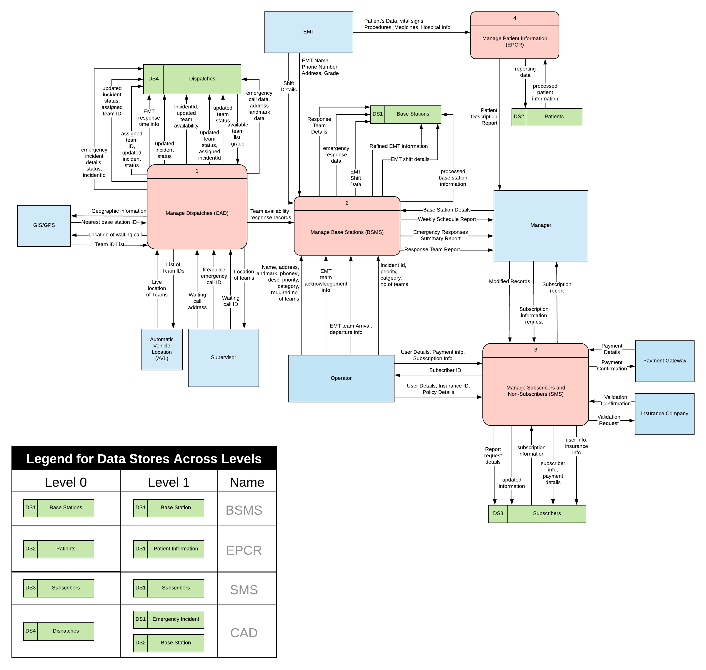
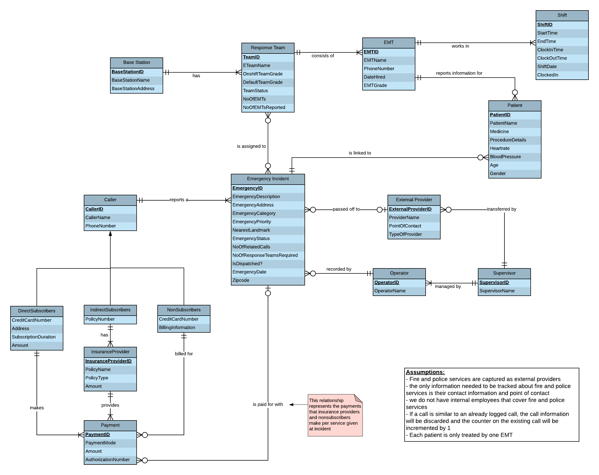
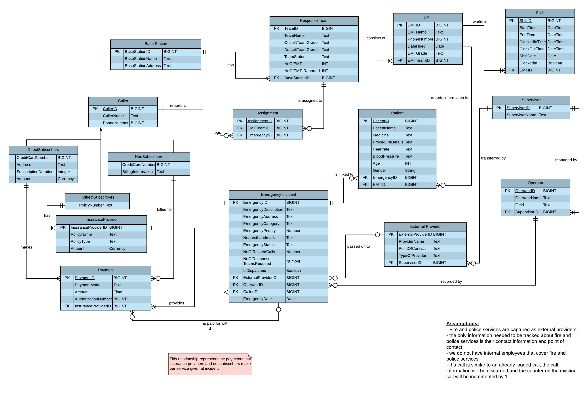
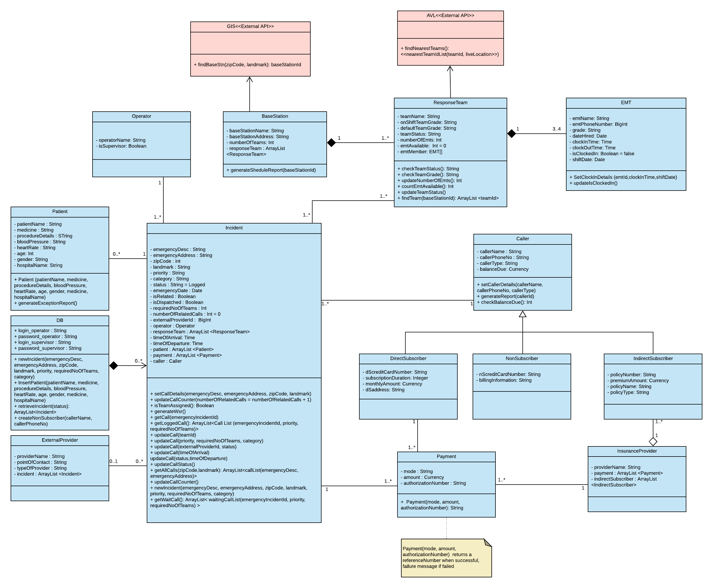
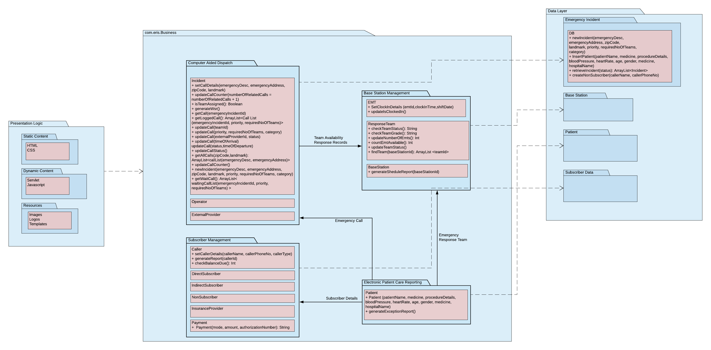
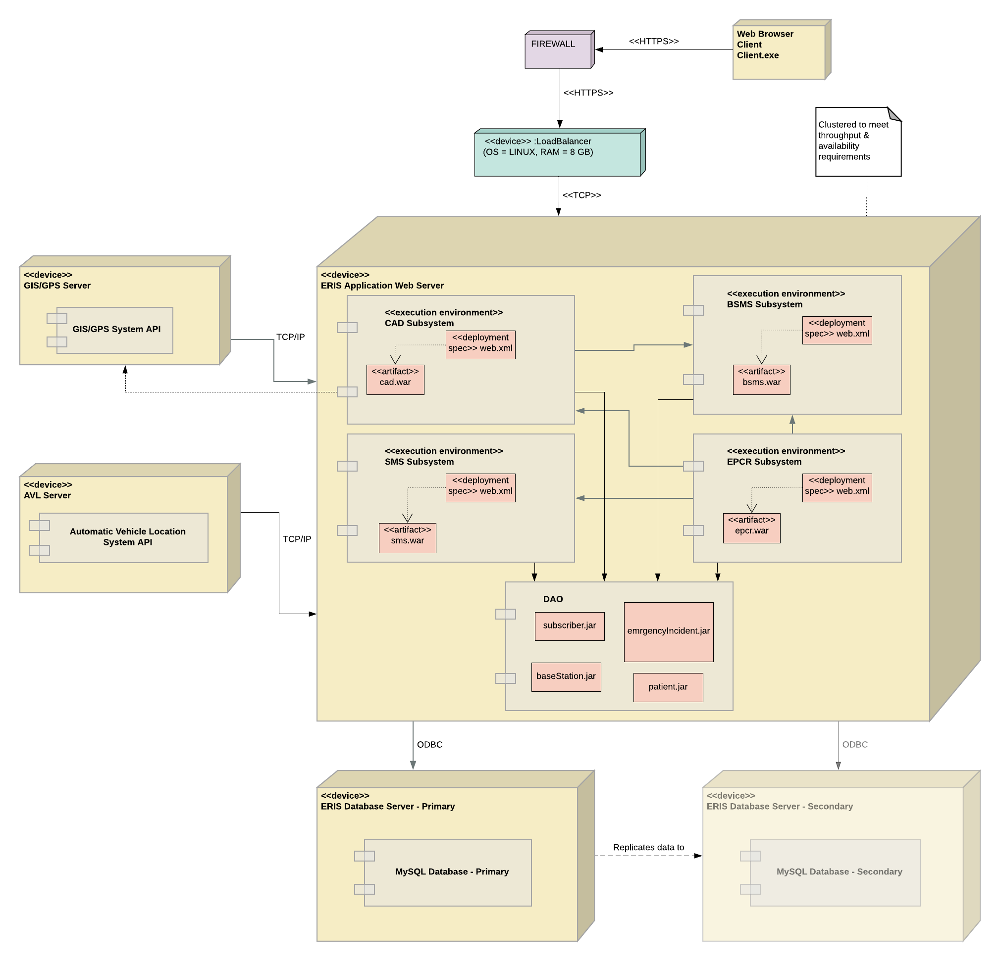

# Rescue911
Rescue911 is a county-wide emergency services company that utilizes a call center to dispatch teams to deal with emergency situations. Rescue 911 requires the creation of an Emergency Response Information System (ERIS) to account for several different business processes the company performs. The four key business processes are logging emergency calls, managing Emergency Medical Technician (EMT) base stations, managing payments of direct and indirect subscribers of the service, and capturing patient care data at the emergency scene. 

## Data Flow Diagram
### Context Level DFD

### Level 0 - DFD

## Entity Relationship Diagram
### Logical ERD

### Physical ERD

## Class Diagram

## Package Diagram

## Deployment Diagram

